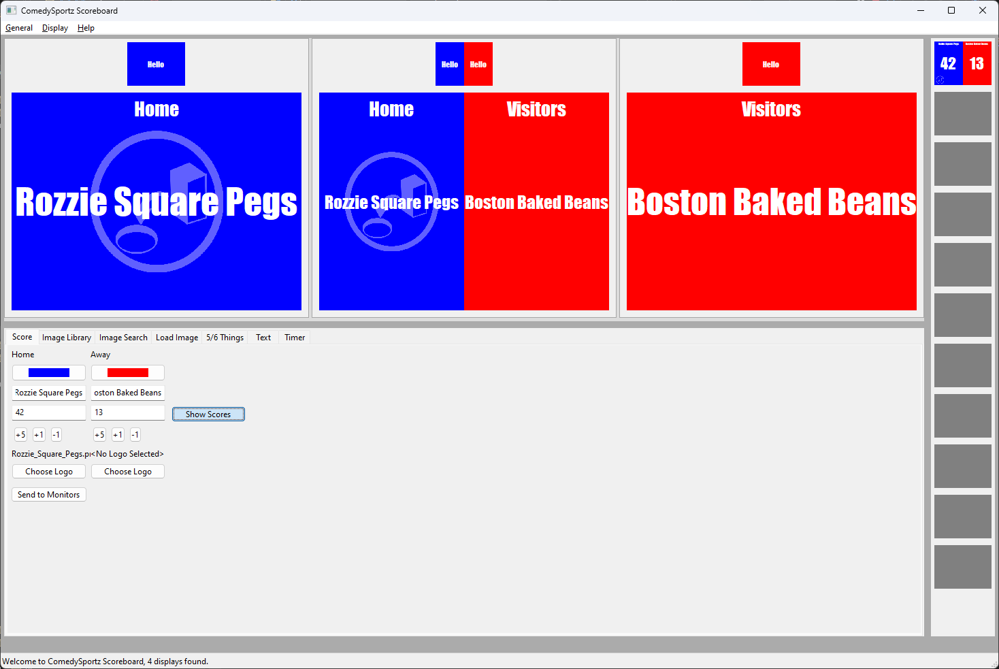
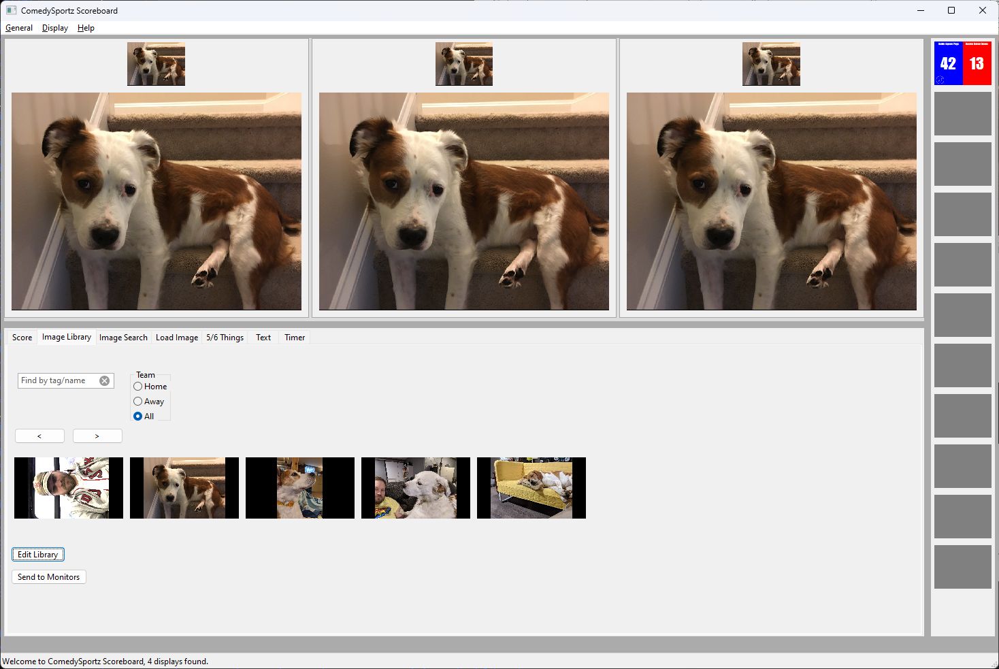
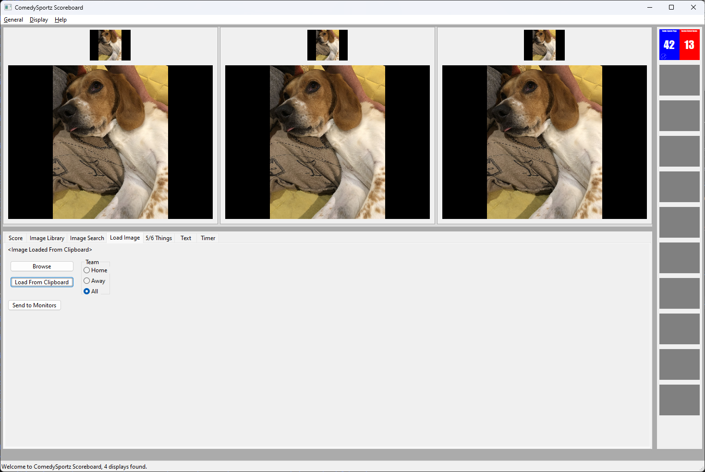
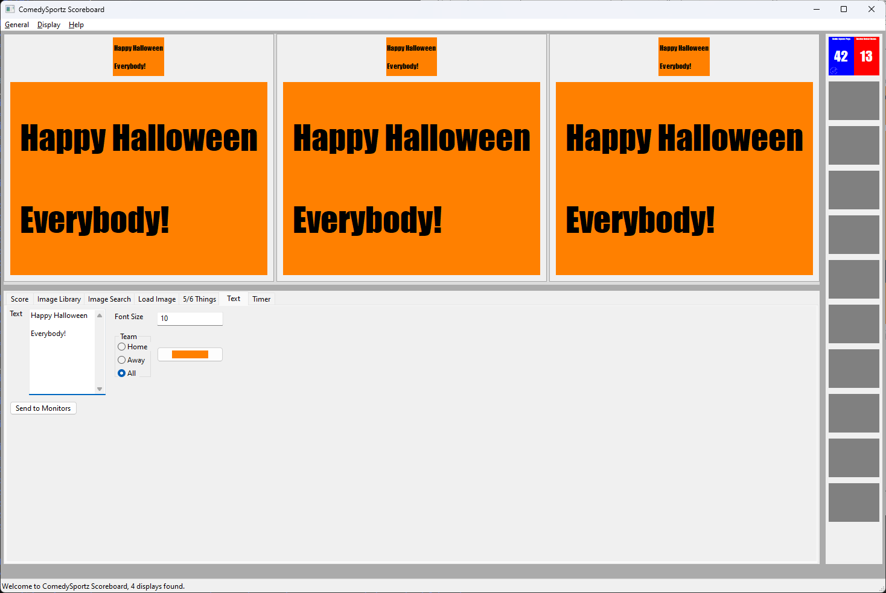
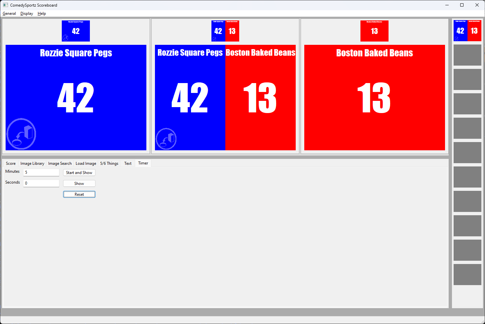
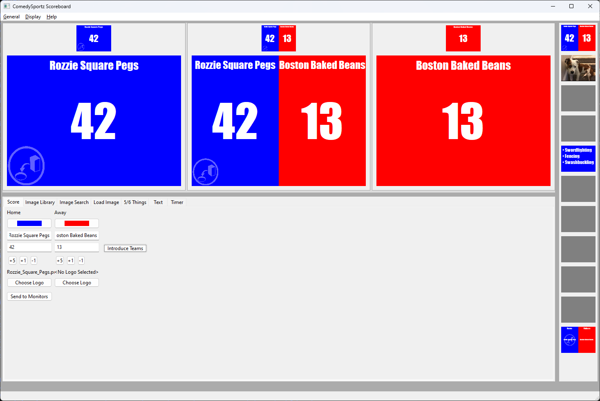

# Cszb-Scoreboard User's Manual

Welcome to the user's manual for cszb-scoreboard.  For an overview of what this is and what it's meant to do, please see [the Readme](../README) for more details.

## Installation

### Windows

Download the Win64 package from [the most recent release](https://github.com/AkbarTheGreat/cszb-scoreboard/releases).  That's it.  The binary you've downloaded is all you need to run the scoreboard.

Please note that whatever directory you save the application to, configuration files will be saved to the same directory.  So if you save cszb-scoreboard.exe to the desktop, expect to see a couple of .data files appear alongside of it as you use the application.

### MacOS

Download the MacOS package from [the most recent release](https://github.com/AkbarTheGreat/cszb-scoreboard/releases).  MacOS packages are bundled in a zip file, so you'll need something like [The Unarchiver](https://theunarchiver.com/)  to extract the application from the zip file.

Please note that whatever directory you extract the application to, configuration files will be saved to the same directory.  So if you extract CszbScoreboard to the desktop, expect to see a couple of .data files appear alongside of it as you use the application.

### Linux

Currently, there is no pre-compiled Linux package.  See [the developer's guide](developers#linux) for a guide to compile on Linux.

## Updates

### Windows

The application will periodically check for new releases in the background.  If it detects one, it will download it and update itself.  The upgrade will not actually take effect until the application's restarted, however.  The status bar will update to indicate that an update has been applied in this case.

### MacOS and Linux

For MacOS and Linux, the application will detect when a new release has been released and update the statusbar to indicate as much.  Please manually update at your earliest convenience when this occurs.

## Interface Overview

When you first start the application, the main (or booth, or control) window should look something like the following, depending on how many monitors it detects connected to your system:

_(image taken in version 0.9.1, some visuals may have changed)_

Of special note are the status bar (along the bottom of the window), the screen previews (the larger blue and red boxes),  the screen thumbnanils (the smaller blue and red boxes),  and the "Send to Monitors" button (at the bottom of the controls at the bottom).

The status bar will display how many monitors were detected at startup, and may show update information later in execution.

The screen thumbnails always reflect what is being shown on the external monitors, for easy reference.

The screen previews represent the current changes being worked on by the operator and will not show on external monitors until the Send to Monitors button is pressed.

The default control tab selected at startup is the score control, which is discussed in greather length below.

## Basic Functionality

Functionally, every external monitor is assigned to one or more teams.  Controls typically allow settings to be made for one or all teams and will go to the screens which represent the selected team.  Every change from a control is immediately reflected in the screen preview panes as they're made.

The settings menu has options to control which monitor represents which team (or is a booth monitor)

Once the previews reflect what the operator would like to present, the Send to Monitors button updates both the external screens as well as the screen thumbnails.  The thumbnails exist to avoid needing to look up at the monitors in the theater itself to see what's shown at the moment.  Additionally, Ctrl+Space exists as a hotkey to press the Send to Monitors button quickly.

Most controls which are team-specific have a team color-picker built-in.  These changes are not saved between executions, but are meant for quick changes during a match.  To change the default color for home/away teams permanently, see the settings menu.

The scoreboard begins with the score control tab selected, but each control tab's functionality is discussed in their own section, below.

### Score

_(image taken in version 0.9.1, some visuals may have changed)_

The controls for score are in two columns, one for each team.  The columns reflect the team order configured in the settings menu.  This means if your theater has away on stage right and home on stage left, changing the settings in the menu will change these controls so that they reflect your physical setup.  Hotkeys also reflect this arrangement (where the left team is controlled by q/a/z and the right team by w/s/x).  The controls, from top to bottom, set the team color, team name, score, quick score updates, and team logo.  See the section below for team logo guidelines.

Additionally, to the right, there is a button which toggles the "Introduce teams" mode, which shows the team names in a large, full-screen format, as below.  To return to the traditional score display, press the button again (which will now be labelled "Show Scores")

_(image taken in version 0.9.1, some visuals may have changed)_

#### Team Logo Guidelines

Team logos should be all white/black pngs.  All white is treated as transparency, all black will be rendered as a gradient of the font color for a semi-transparent overlay.

### Image Library

The image library allows you to save a collection of images in a searchable database for quick reference during a match.  The edit library button on the bottom opens a dialog which allows you to edit the list of images as well as the display name (shown below each image in the library view) and the tags associated with that image.

The arrow buttons above the images can be used to scroll through images.  The Team selector at the top selects which team's monitors will display the given image.

_(image taken in version 0.9.1, some visuals may have changed)_

All images in the library may have tags, and the search box allows easy searching of those tags.  As tags are matched, all matching tags are shown below the search box.  If a tag matches exactly, it's the only tag shown.  A grey box indicates that no additional images are found.

_(image taken in version 0.9.1, some visuals may have changed)_

**Notes**

---

Images are not copied into the library, just the location of the image.  Moving an image on disk that's in the library would necessitate re-adding that image to the library.

Tags are searched, but not image names.  If you intend to search by name, add the name as a tag as well.

Just in case something goes wrong, image_library.data contains the image library itself and may be backed up however you prefer to back up files.

---
### Load Image

_(image taken in version 0.9.1, some visuals may have changed)_

Load Image is the tab you want when you have an image that's not in your image library.  The browse button will open a file browser for supported image types (bmp/gif/jpeg/png).

The "Load from clipboard" button attempts to load image data directly from the clipboard, giving an error if the clipboard does not appear to contain an image.

### 5/6 Things

_(image taken in version 0.9.1, some visuals may have changed)_

The 5/6 Things tab is useful for displaying lists of items for guessing games, in particular 5 Things or 6 Things, where there are multiple items and multiple substitutions for items.  It defaults to five activities with two substitutions per activity.

The "New Activity" and "New Replacement" buttons add a new item to the bottom of their respective list.  The "X" button beside of each entry deletes that entry.  The arrows beside of each entry allow for reordering entries.

The radio buttons beside of each activity change the replacement box to the replacements for that activity for editing or display.  The "present" selector at the top determines whether the list of activities or the list of replacements will be shown on the screen previews (and then on to the screens themselves, potentially).

An important note is that each team's list is a separate list (as well as the combined list), so in a head-to-head game of 6 things, for instance, where each team has 3 activities, the app can manage two lists of three activites, one for each team.

### Text

_(image taken in version 0.9.1, some visuals may have changed)_

This tab is pretty straight-forward.  You type in text to be shown and it displays.  The font size is a relative font, so it's less important to know what 10 or 20 means other than 20 is twice as large as 10.  Additionally, if the text outgrows a screen, it will be auto-scaled down, so the font size is the maximum font size.

### Timer

_(image taken in version 1.1.0, some visuals may have changed)_

This tab controls a timer which overlays on every other view.  The view you see in the preview pane will be the last tab you were in, timers are either shown on all windows (previews/thumbnails/external monitors) or none at all.  The three buttons present start/pause the timer, show/hide the timer, and reset the timer to it's specified value (in the fields to the left), respectively.  Changing the value of the timer in the numeric fields implicitly resets the timer to the new value, even if the timer is currently running.  Once running, the timer looks like this:

_(image taken in version 1.1.0, some visuals may have changed)_

## Quick States

_(image taken in version 0.9.3, some visuals may have changed)_

Along the right-hand side of the window are 10 settable quick-states, for queuing up items to be displayed quickly.  Note that these are snapshots of a control's state, so, for instance, setting one of these to score will always show the score as of the time of the snapshotting (it will not update as the score changes).  This can be useful for flipping back and forth between a set 5 things list or setting up game displays ahead of time.  Whatever is convenient for your show.

Right click on any of the (initially gray) boxes to set the quick state to the current screen preview state.  Left clicking any populated quick state will send that state immediately to the monitors (leaving the current preview alone).  Additionally there are hotkeys for each state, Ctrl + [1-0] will use the currently set state, Ctrl + Alt + [1-0] will set the state to the current preview state.

## Hotkeys

* Ctrl+Space - Send to Monitors
* Ctrl+b - Black Out (Immediately blacks out all monitors
* Ctrl+Tab - Next control tab
* Ctrl+Shift+Tab - Previous control tab
* Ctrl+q - Left team score +5
* Ctrl+a - Left team score +1
* Ctrl+z - Left team score -1
* Ctrl+w - Right team score +5
* Ctrl+s - Right team score +1
* Ctrl+x - Right team score -1
* Ctrl+_number_ - Display quick state _number_ to the monitors.  (1 is the first display, 9 is next-to-last, 0 is last)
* Ctrl+Alt+_number_ - Set quick state _number_ to the current preview state.
